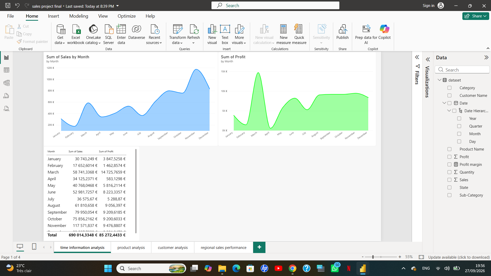
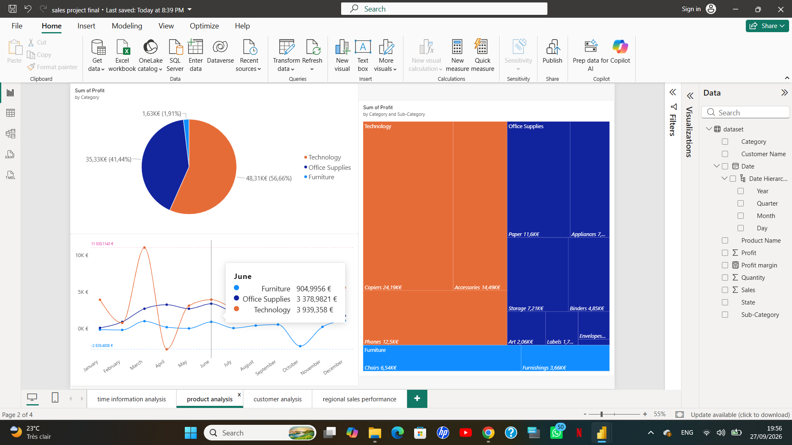
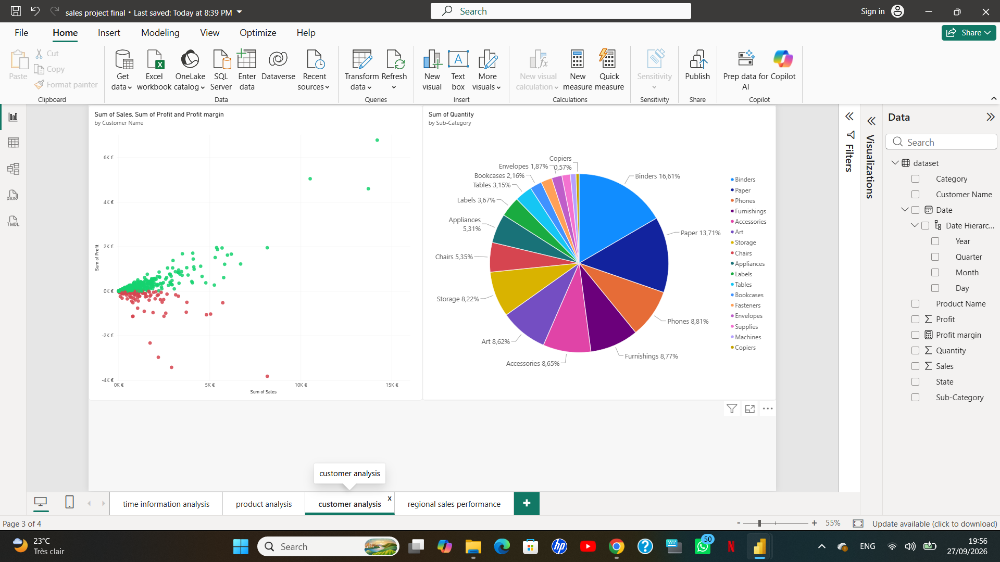
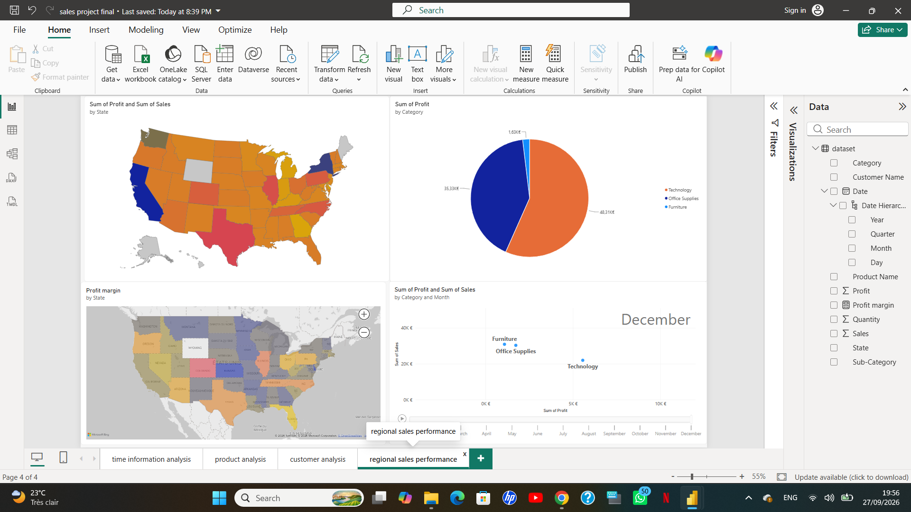

# 📊 Power BI Sales Dashboard

## 📌 Project Overview

This project is an interactive sales dashboard developed using Microsoft Power BI.

The objective of the project was to transform sales data into an interactive and easy-to-understand dashboard that can be used to explore sales performance, trends, and business information.

This is my **first Power BI project** and an important step in building my Data Analytics portfolio.

---

## 🛠️ Tools & Technologies

* **Microsoft Power BI**
* **Power Query**
* **DAX**
* Data Cleaning & Transformation
* Data Visualization
* Dashboard Design

---

## 🔄 Project Workflow

The project followed several stages of the data analysis process:

1. **Data Preparation**

   * Imported the dataset into Power BI
   * Reviewed the available data
   * Prepared the data for analysis

2. **Data Cleaning & Transformation**

   * Used Power Query to transform the data
   * Prepared columns and data types for analysis
   * Organized the dataset for visualization

3. **Data Analysis**

   * Created calculations and measures using DAX
   * Analyzed sales-related information
   * Explored trends and performance indicators

4. **Data Visualization**

   * Designed interactive charts and visualizations
   * Organized the dashboard into multiple pages
   * Added filters and interactive elements

5. **Dashboard Development**

   * Created a 4-page interactive Power BI dashboard
   * Focused on presenting information in a clear and accessible way

---

## 📊 Dashboard

The dashboard contains four pages designed to provide different views of the sales data.

### Page 1

### Page 2

### Page 3

### Page 4

---

## 🎯 Skills Demonstrated

Through this project, I practiced:

* Data cleaning and transformation
* Power Query
* DAX
* Data visualization
* Interactive dashboard development
* Business-oriented data presentation
* Power BI dashboard design

---

## 📚 Key Learning

This project gave me hands-on experience with the Power BI workflow, from preparing data to creating an interactive dashboard.

It also helped me better understand how data visualization can be used to transform raw data into information that is easier to explore and understand.

---

## 🚀 Next Steps

This project is the beginning of my Data Analytics portfolio.

Future projects will focus on:

* SQL data analysis
* More advanced Power BI dashboards
* Python for data analysis
* End-to-end data analytics projects

---

## 👤 Author

**Reda Hairy**

Aspiring Data Analyst | Power BI | SQL | Excel

https://www.linkedin.com/in/reda-hairy/
